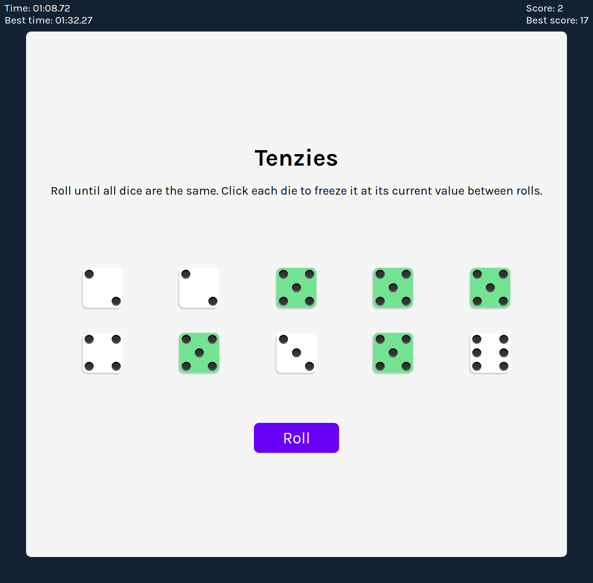
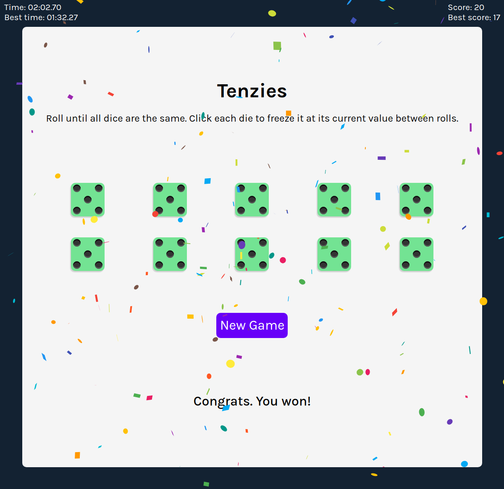
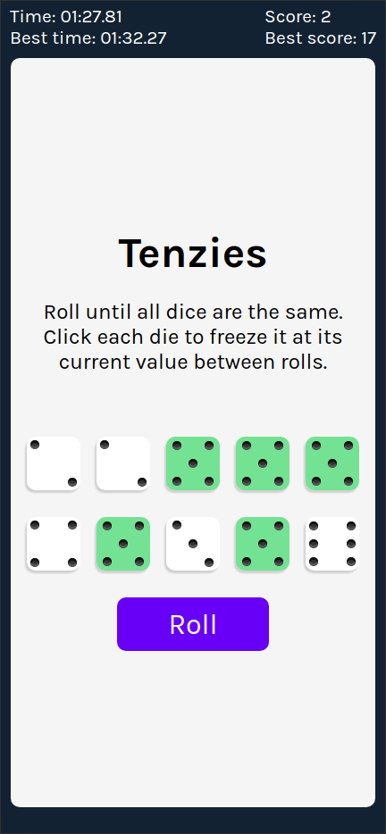

# Scrimba React Project #7: Tenzies game

The goal of this Scrimba project was to create a tenzies game using React.

I started and finished this project in June 2023.

## Assignment

[Scrimba - Learn React - #7 Tenzies game](https://scrimba.com/learn/learnreact)

## Technology

- React
- JavaScript
- Vite
- CSS

## Key Concepts

- State: useState, changing state, updating state objects and arrays
- useEffect: side effects, syntax, dependencies array
- Event listeners in React
- Conditional rendering: && and ternary operator ? :

## Features

- Dots on the dice.
- Track number of rolls.
- Track time it took to win.
- Save best results.
- Confetti effect when user wins.

## Links

[Live Demo](https://brightneon7631.github.io/scrimba-tenzies-game/)

[My Other Projects](https://brightneon7631.github.io/odin-scrimba-projects/)

## Screenshots

### Desktop





### Mobile



## Sources

- https://fonts.google.com/specimen/Karla

## Deployment

```bash
# clone repo
git clone

# install project dependencies
npm install

# run vite dev server
npm run dev

# create a production build
npm run build
```